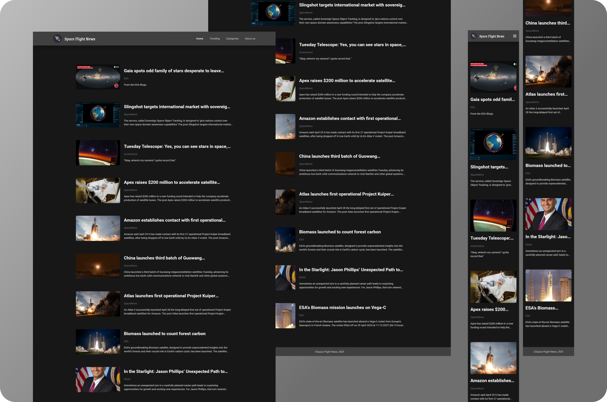

<div align="center">


</div>

<br>

<h1 align="center">Space Flight Articles - Ada Tech</h1>


### 🧭 Navegação Rápida

- 📝 [Sobre](#-sobre)
- 🧪 [Extends do Projeto](#-extends-do-projeto)
- 🚀 [UI e Deploy](#-ui-e-deploy)
- ▶️ [Como Configurar o Projeto no VS Code](#️-como-configurar-o-projeto-no-vs-code)
- 🤝 [Contribuição](#-contribuição)

---

### 📝 Sobre
Projeto desenvolvido durante a **Formação em Desenvolvimento Front-End | Santander Tech+ | Ada Tech**, com o objetivo de praticar o uso de **`props`** e o reaproveitamento de componentes em **React.JS**.

---
### 🧪 Extends do Projeto
🎨 Estilização com **Tailwind CSS**, instalado em um ambiente configurado com Vite.<br>
📁 Organização dos dados em um arquivo externo, simulando um **banco de dados**.<br>
🔁 Renderização dinâmica utilizando o método **`.map()`**, para reaproveitar componentes de forma eficiente.<br>
♻️ Estrutura pensada para escalabilidade e manutenção do código.

---

### 🚀 UI e Deploy
<div align="center">
<p >
  
</p>

[→ Ver Projeto On-line 🔗](https://space-flight-articles-puce.vercel.app/)

</div>

---


## ▶️ Como Configurar o Projeto no VS Code:

### 📌 Pré-requisitos
Antes de prosseguir com a configuração, certifique-se de ter todos os pré-requisitos instalados corretamente para evitar erros durante a instalação e execução do projeto:

`Git 2.4+` `Node.js 12+` `Live Server` `Tailwind CSS IntelliSense`


### ⚙️ Configurando o Projeto

1. Clone este repositório:
Abra o **VS Code**, pressione `Ctrl + Shift + P`, digite **"Git Clone"** e cole o link do repositório:
```sh
https://github.com/domfabio/Space-Flight-Articles.git
```
2. Instalar Dependências:
```sh
npm install
```
3. Inicie o servidor de desenvolvimento:
```sh
npm run dev
```
4. Acesse o projeto no navegador:<br>
No terminal, pressione `Ctrl + Clique` no link gerado:<br>
 ➜  Local:   http://localhost:5173/

---

## 🤝 Contribuição
**Se deseja contribuir, siga os passos:**
1. Fork o repositório
2. Crie uma branch: `git checkout -b feature-minha-feature`
3. Faça commit das suas mudanças: `git commit -m 'Minha nova funcionalidade'`
4. Faça push para a branch: `git push origin feature-minha-feature`
5. Abra um Pull Request

---

Este projeto é distribuído sob a [Open Source License - MIT](https://opensource.org/licenses/MIT). <br>Veja a documentação para mais detalhes.


